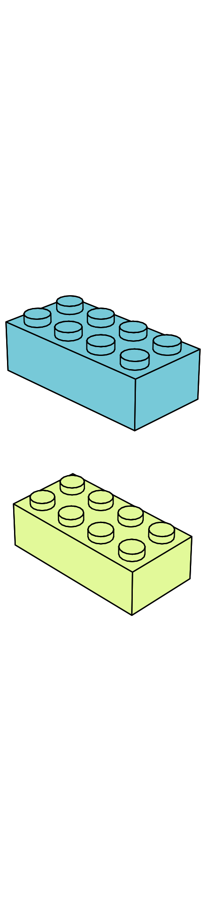
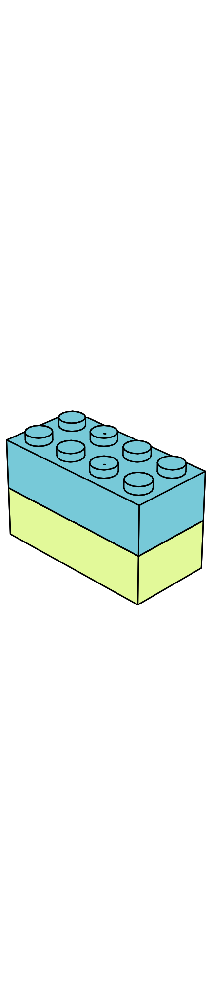
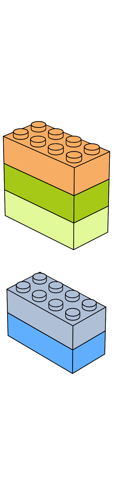
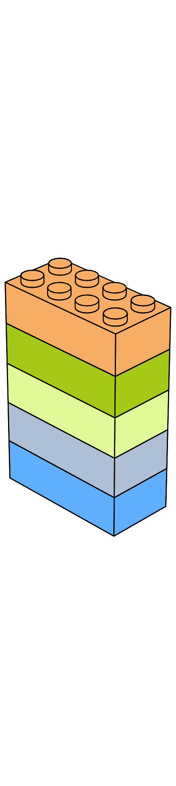
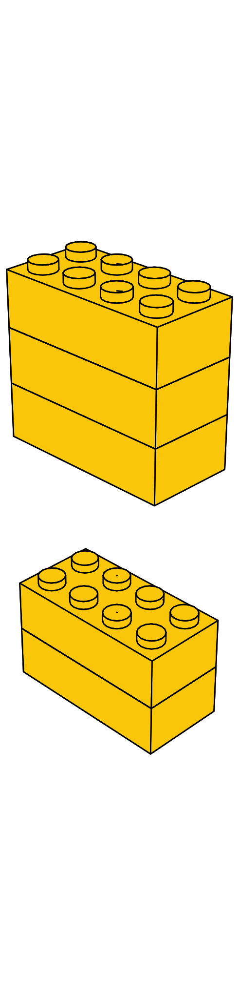
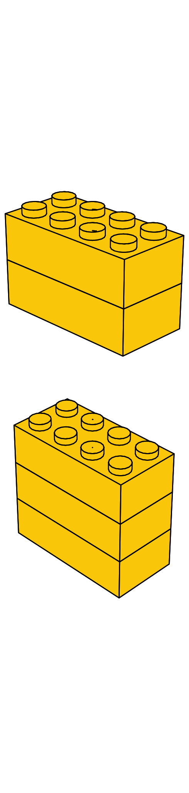
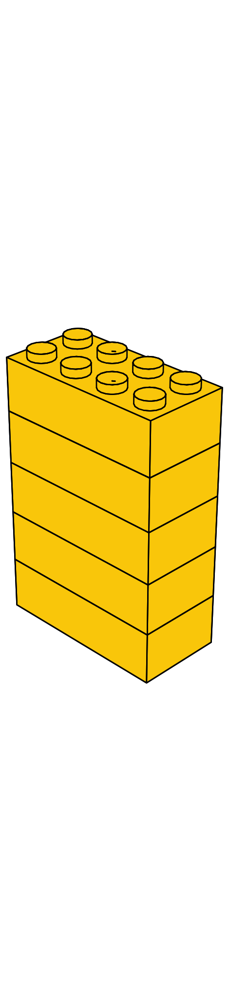

## Addition and substraction $\text{[brick:1.0em]{.twemoji}}$

Imagine that you are building a tower out of LEGO bricks. Each time you add a brick to the top, the total number of bricks in the tower increases, meaning the tower gets taller. If you start with one brick and add a second, the tower is now one brick taller. Now, you have $2$ bricks.


::: {#fig-addition-1-plus-1 layout-ncol=2}

{#fig-add-1-before fig-align="center" width="30%"}

{#fig-add-1-after fig-align="center" width="30%"}

Adding $1$ block.
:::

Similarly, if you start with $2$ blocks and add $3$, your tower's height increases by $3$, it is now $5$ blocks tall.

::: {#fig-addition-2-plus-3 layout-ncol=2}

{#fig-add-3-before fig-align="center" width="30%"}

{#fig-add-3-after fig-align="center" width="30%"}

Adding $3$ blocks.
:::


**Adding up**  means increasing a quantity by another quantity, or combining two quantities to obtain a new, larger, quantity. There is small nuance to this definition that we will review once we have introduced negative numbers.

We use the $\color{red}{\text{plus}}$ symbol $\color{red}{+}$  to represent addition, and the symbol $\color{blue}{\text{=}}$, or  $\color{blue}{\text{equals}}$, to represent the result.

Using this notation we can represent the previous statements more compactly as: 

- $1 {\color{red}{\text{ plus }}} 1 {\color{blue}{\text{ equals }}} 2  \to$ [$1{\color{red}{+}}1{\color{blue}{=}}2$]{.scale factor="1"}, and
-  $3 {\color{red}{\text{ plus }}} 2 {\color{blue}{\text{ equals }}} 5 \to$ [$3{\color{red}{+}}2{\color{blue}{=}}5$]{.scale factor="1"}.

```{python}
# | echo: false
# | label: sum-legos-1-1
# | fig-cap: "1 LEGO block plus 1 LEGO block equals 2 LEGO blocks."

from yoyo_plots.operations import draw_quantity_operation
from yoyo_plots.common import display_vector


op1 = dict(image="/static_images/legos/11/11_a.svg", n=1, quantity=1, font_color="black", nrows=1, image_size=5.0)
op2 = dict(image="/static_images/legos/11/11_b.svg", n=1, quantity=1, font_color="black", nrows=1, image_size=5.0)
res = dict(image="/static_images/legos/11/11_c.svg", n=1, quantity=2, font_color="black", nrows=1, image_size=5.0)

fig_op = draw_quantity_operation(
    op1,
    op2,
    res,
    operation="+",
    font_size=50,
)
display_vector(fig_op)
```
```{python}
# | echo: false
# | label: sum-legos-2-3
# | fig-cap: "2 LEGO blocks plus 3 LEGO blocks equals 5 LEGO blocks."

from yoyo_plots.operations import draw_quantity_operation
from yoyo_plots.common import display_vector

op1 = dict(image="/static_images/legos/23/23_a.svg", n=1, quantity=2, font_color="black", nrows=1, image_size=3.5)
op2 = dict(image="/static_images/legos/23/23_b.svg", n=1, quantity=3, font_color="black", nrows=1, image_size=3.5)
res = dict(image="/static_images/legos/23/23_c.svg", n=1, quantity=5, font_color="black", nrows=1, image_size=3.5)

fig_op = draw_quantity_operation(
    op1,
    op2,
    res,
    operation="+",
    font_size=50,
)
display_vector(fig_op)
```


When you're done playing or you want to build something more exciting than a tower, or when your mom asks you to clean up, you start removing blocks out of the tower and putting them in the LEGO box. This decreases the number of blocks in the tower, making the tower shorter and shorter.

**Substraction** means **removing** things. We use the  *minus* sign, $\color{red}{-}$ to represent this.  For instance, if your LEGO tower has $5$ blocks and you *remove* $3$, you are left  now with $5 {\color{red}{\text{ minus }}} 3$, which ${\color{blue}{\text{ equals }}} 2$. Using the new notation we just learned: [$5 {\color{red}{-}} 3 {\color{blue}{=}} 2$]{.scale factor="1"}.

```{python}
# | echo: false
# | label: sum-legos-3-4
# | fig-cap: "5 LEGO blocks minus 3 LEGO blocks equals 2 LEGO blocks."

from yoyo_plots.operations import draw_quantity_operation
from yoyo_plots.common import display_vector

op1 = dict(image="/static_images/legos/23/23_c.svg", n=1, quantity=5, font_color="black", nrows=1, image_size=3.5)
op2 = dict(image="/static_images/legos/23/23_b.svg", n=1, quantity=3, font_color="black", nrows=1, image_size=3.5)
res = dict(image="/static_images/legos/23/23_a.svg", n=1, quantity=2, font_color="black", nrows=1, image_size=3.5)

fig_op = draw_quantity_operation(
    op1,
    op2,
    res,
    operation="-",
    font_size=50,
)
display_vector(fig_op)
```


### Exercises {.unnumbered .unlisted}

```{python}
# | echo: false
# | fig-align: "center"

from yoyo_plots.operations import draw_quantity_operation
from yoyo_plots.common import display_vector

op1 = dict(image="/static_images/legos/44/44_a.svg", n=1, quantity=4, font_color="black", nrows=1, image_size=3.5)
op2 = dict(image="/static_images/legos/44/44_b.svg", n=1, quantity=4, font_color="black", nrows=1, image_size=3.5)
res = dict(image="/static_images/legos/44/44_c.svg", n=1, quantity=4, font_color="white", nrows=1, image_size=3.5)

fig_op = draw_quantity_operation(
    op1,
    op2,
    res,
    operation="+",
    font_size=50,
)
display_vector(fig_op)
```


```{python}
# | echo: false
# | fig-align: "center"

from yoyo_plots.operations import draw_quantity_operation
from yoyo_plots.common import display_vector

op1 = dict(image="/static_images/legos/35/35_c.svg", n=1, quantity=8, font_color="black", nrows=1, image_size=3.5)
op2 = dict(image="/static_images/legos/35/35_b.svg", n=1, quantity=5, font_color="black", nrows=1, image_size=3.5)
res = dict(image="/static_images/legos/35/35_a.svg", n=1, quantity=3, font_color="white", nrows=1, image_size=3.5)

fig_op = draw_quantity_operation(
    op1,
    op2,
    res,
    operation="-",
    font_size=50,
)
display_vector(fig_op)
```


Of course, you can add and substract with other things than LEGO blocks.

```{python}
# | echo: false
# | fig-align: "center"

from yoyo_plots.operations import draw_quantity_operation
from yoyo_plots.common import display_vector

op1 = dict(image="/icon_images/whale.svg", n=2, font_color="black", nrows=2)
op2 = dict(image="/icon_images/whale.svg", n=7, font_color="black", nrows=3)
res = dict(image="/icon_images/whale.svg", n=9, font_color="white", nrows=3)

fig_op = draw_quantity_operation(
    op1,
    op2,
    res,
    operation="+",
    font_size=50,
)
display_vector(fig_op)
```

```{python}
# | echo: false
# | fig-align: "center"

from yoyo_plots.operations import draw_quantity_operation
from yoyo_plots.common import display_vector

op1 = dict(
    image="/icon_images/submarine.svg", n=4, font_color="black", nrows=3
)
op2 = dict(
    image="/icon_images/submarine.svg", n=4, font_color="black", nrows=3
)
res = dict(
    image="/icon_images/submarine.svg", n=8, font_color="white", nrows=3
)

fig_op = draw_quantity_operation(
    op1,
    op2,
    res,
    operation="+",
    font_size=50,
)
display_vector(fig_op)
```

```{python}
# | echo: false
# | fig-align: "center"

from yoyo_plots.operations import draw_quantity_operation
from yoyo_plots.common import display_vector

op1 = dict(
    image="/icon_images/stegosaurus.svg", n=6, font_color="white", nrows=2
)
op2 = dict(
    image="/icon_images/stegosaurus.svg", n=5, font_color="white", nrows=2
)
res = dict(
    image="/icon_images/stegosaurus.svg", n=1, font_color="white", nrows=2
)

fig_op = draw_quantity_operation(
    op1,
    op2,
    res,
    operation="-",
    font_size=50,
)
display_vector(fig_op)
```

```{python}
# | echo: false
# | fig-align: "center"

from yoyo_plots.operations import draw_quantity_operation
from yoyo_plots.common import display_vector

op1 = dict(
    image="/icon_images/elephant1.svg", n=4, font_color="white", nrows=2
)
op2 = dict(
    image="/icon_images/elephant1.svg", n=4, font_color="white", nrows=2
)
res = dict(
    image="/icon_images/elephant1.svg", n=0, font_color="white", nrows=2
)

fig_op = draw_quantity_operation(
    op1,
    op2,
    res,
    operation="-",
    font_size=50,
)
display_vector(fig_op)
```

```{python}
# | echo: false
# | fig-align: "center"

from yoyo_plots.operations import draw_quantity_operation
from yoyo_plots.common import display_vector

op1 = dict(
    image="/icon_images/panda_in_love.svg", n=1, font_color="black", nrows=1
)
op2 = dict(
    image="/icon_images/panda_in_love.svg", n=1, font_color="black", nrows=1
)
res = dict(
    image="/icon_images/panda_in_love.svg", n=0, font_color="white", nrows=1
)

fig_op = draw_quantity_operation(
    op1,
    op2,
    res,
    operation="-",
    font_size=50,
)
display_vector(fig_op)
```

Finally, these operations can also be done with the abstract numbers, without relating them to a particular object.

When adding more than two numbers, we split the operation into multiple steps, we start by adding up the first two numbers, then add the result to the next number, and so on. We can represent this way of *associating* numbers with parenthesis, for instance  $0 + 1 + 2 + 3$ we can do it like 


::: {.big-math}
$$
\underbrace{\underbrace{(\underbrace{(0+1)}_{\text{Step 1}}+2)}_{\text{Step 2}}+3}_{\text{Step 3}} = 6
$$


$$
\underbrace{
  \underbrace{
    \underbrace{0 + 1}_{1} + 2
  }_{3} + 3
}_{6}
$$
:::

Compute the following sums and differences.

::: {.big-math}
\begin{align*}
3 + 2 &= \boxed{5} \\
1 + 1 &= \boxed{2} \\
2 + 3 + 1 &= \boxed{\phantom{3}} \\
1 + 0 &= \boxed{\phantom{5}}\\
0 + 1 + 2 + 3 &= \boxed{\phantom{5}}\\
9 - 0 &= \boxed{\phantom{5}}\\
9 - 1 &= \boxed{\phantom{5}}\\
9 - 2 &= \boxed{\phantom{5}}\\
9 - 3 &= \boxed{\phantom{5}}\\
7 - 4 &= \boxed{\phantom{5}}\\
0 + 0 &= \boxed{\phantom{5}}\\
3 - 3 &= \boxed{\phantom{5}}\\
3 + 5 &= \boxed{\phantom{5}}\\
5 + 3 &= \boxed{\phantom{5}}\\
5+ 3 -3 &= \boxed{\phantom{5}}\\
5+ 2 -3 &= \boxed{\phantom{5}}\\
\end{align*}
:::

:::{.question title="The order doesn't matter"}
Sometimes, the order of things matters. For example, it matters whether you put on first your shoes $\text{[running_shoe:2em:0em:2]{.twemoji}}$ or your socks $\text{[socks:2em]{.twemoji}}$. 

Other times, order doesn't matter, such as when adding up numbers.  For instance, did you notice that $3 + 2$ yields the same result as $2+3$?
:::


::: {layout-ncol=3}
{#fig-add-3-before fig-align="center" width="30%"}

{#fig-add-3-before fig-align="center" width="30%"}

{#fig-add-3-after fig-align="center" width="30%"}
:::

In the general case we have 

:::{.big-math}
$$
 a + b = b + a
$$
:::

$a$ and $b$ represent any two numbers. We say that addition is **commutative**, meaning the order of the numbers being added does not matter.


Provided you enter the right answers in the previous examples, we say that the equality holds. Try now yourself to create some equalities that hold, both with additions ('$+$') and substractions ('$-$').

:::{.teacher-tip}
Encourage the kids to do this on their own, you can provide a few examples.
:::


::: {.big-math}
\begin{align*}
\boxed{\phantom{5}} \quad \boxed{\phantom{5}} \quad \boxed{\phantom{5}} &= \boxed{\phantom{5}} \\
\boxed{\phantom{5}} \quad \boxed{\phantom{5}} \quad \boxed{\phantom{5}} &= \boxed{\phantom{5}} \\
\boxed{\phantom{5}} \quad \boxed{\phantom{5}} \quad \boxed{\phantom{5}} &= \boxed{\phantom{5}} \\
\boxed{\phantom{5}} \quad \boxed{\phantom{5}} \quad \boxed{\phantom{5}} &= \boxed{\phantom{5}} \\
\boxed{\phantom{5}} \quad \boxed{\phantom{5}} \quad \boxed{\phantom{5}} &= \boxed{\phantom{5}} \\
\boxed{\phantom{5}} \quad \boxed{\phantom{5}} \quad \boxed{\phantom{5}} &= \boxed{\phantom{5}} \\
\boxed{\phantom{5}} \quad \boxed{\phantom{5}} \quad \boxed{\phantom{5}} &= \boxed{\phantom{5}} \\
\boxed{\phantom{5}} \quad \boxed{\phantom{5}} \quad \boxed{\phantom{5}} &= \boxed{\phantom{5}} \\
\boxed{\phantom{5}} \quad \boxed{\phantom{5}} \quad \boxed{\phantom{5}} &= \boxed{\phantom{5}} \\
\boxed{\phantom{5}} \quad \boxed{\phantom{5}} \quad \boxed{\phantom{5}} &= \boxed{\phantom{5}} \\
\end{align*}
:::


## Playing hide-and-seek with numbers $\text{[ghost:1.0em]{.twemoji}}$

::: {.fun-fact title="Playing hide-and-seek" image="/static_images/puzzle.pdf" width="0.7" scale="0.9"}
Did you know that with the operations you just learned, you can actually play hide-and-seek? The game consist in finding numbers that are hiding? It is like finding the missing piece of a puzzle. 

In elementary algebra we call those hiding numbers "unknowns" or "variables".
:::

To find the value of the hidden number in the following equation, ask yourself: What number plus $2$ equals $7$?

::: {.big-math}
$$
\text{[puzzle_piece:1em]{.twemoji}}  + 2 = 7
$$
:::


The answer:

::: {.big-math}
$$
\text{[puzzle_piece:1em]{.twemoji}} = 5
$$
:::

Because 

:::{.big-math}
$$
5 + 2 = 7
$$
:::


### Exercises {.unlisted .unnumbered}


In the following equations, find the uknown. The hidden numbers are hidding inside a box like this one $\boxed{\phantom{5}}$, go and find them!


::: {.big-math}
\begin{align*}
\boxed{\phantom{5}} + 3 &= 8\\
\boxed{\phantom{5}} + 7 &= 8\\
7 + \boxed{\phantom{5}} &= 8\\
2 - \boxed{\phantom{5}} &= 0\\
2 - \boxed{\phantom{5}} &= 1\\
\boxed{\phantom{5}} + 3&= 8\\
7 + \boxed{\phantom{5}} &= 7\\
7 - \boxed{\phantom{5}} &= 7\\
9 + \boxed{\phantom{5}} &= 9\\
9 - \boxed{\phantom{5}} &= 9\\
1 + \boxed{\phantom{5}} &= 2\\
2 - \boxed{\phantom{5}} &= 1\\
\end{align*}
:::

::: {.fun-fact image="/static_images/ghost.pdf" width="0.7" scale="0.9"}
In algebra those unknown variables are usually represented by letters, like $\color{red}{x}$ or $\color{red}{\alpha}$.

So, instead of $3 + \boxed{\phantom{4}} = 7$, you will see $3 + {\color{red}{\alpha}} = 7$. We will learn later on powerful methods for finding not one but multiple of those sneaky numbers, provided they exist!
:::


In many instances in science and engineering you are not given these equations, but instead some observations or a problem. Nature speaks mathematics, but still you will have to convert observations into equations.

- Example 1: f I tell you that Zoe is $2$ years older than you, and then I ask you what's Zoe's age? How would you go about and solve this problem? In this kind of problems you always have two categories, what you know: the data, observations, given information, and what you don't know, the sneaky unknowns. In this case you know your own age, let's say $5$, and you know that Zoe is $2$ years older. The resulting equation would be:

::: {.big-math}
$$
\begin{aligned}
5 + 2 &= \boxed{\phantom{5}} \
\end{aligned}
$$
:::

- Example 2: the temperature tomorrow is going to be $3$ degrees colder than today. It is going to fall to $6$ degrees. What is the temperature today? In this case the data is the temperature tomorrow, $6$ degrees, and the relationship between today and tomorrow, that is the temperature tomorrow is $3$ degrees colder than today. The unknown is the temperature today. The resulting equation would be:

::: {.big-math}
$$
\begin{aligned}
\boxed{\phantom{5}} - 3 &= 6 \
\end{aligned}
$$
:::

- In the Zoo there are 2 lions $\text{[lion:1.5em:0em:2]{.twemoji}}$, 2 elephants $\text{[elephant:1.5em:0em:2]{.twemoji}}$, $1$ giraffe $\text{[giraffe:1.5em]{.twemoji}}$ and an unkown number of orangutans $\text{[orangutan:1.5em]{.twemoji}}$?. If the total number of animals in the zoo is $9$, how many orangutans are there?

::: {.big-math}
\begin{align*}
\boxed{\phantom{5}} \quad + \quad \boxed{\phantom{5}} \quad + \quad \boxed{\phantom{5}} &= \boxed{\phantom{5}} \\
\boxed{\phantom{5}} \quad - \quad \boxed{\phantom{5}} &= \boxed{\phantom{5}}
\end{align*}
:::

- If I remove all the red blocks from a tower that is $7$ blocks tall, I am left with $2$ blocks. How many red blocks were there in the tower?

::: {.big-math}
$$
\begin{aligned}
\boxed{\phantom{5}} \quad \boxed{\phantom{5}} \quad \boxed{\phantom{5}} &= \boxed{\phantom{5}}
\end{aligned}
$$
:::


- The distance between two cities is $7$ kilometers. If I have already traveled $4$ kilometers, how many kilometers do I have left to travel?

::: {.big-math}
$$
\begin{aligned}
\boxed{\phantom{5}} \quad \boxed{\phantom{5}} \quad \boxed{\phantom{5}} &= \boxed{\phantom{5}}
\end{aligned}
$$
:::


## A preview of multiplication

A special case of addition (or substraction) is when you add a number to itself. For instance $3+3$, what we can read as three plus three, but also two *times* three. There is nothing stopping us at two times, so we can also continue to $3+3+3$, which is read three *times* three, or $3+3+3+3$ or four *times* three.

This operation, repeated addition, is called multiplication and is represented by the *times* symbol $\times$. 

We can then write $3+3+3+3$ in a more compact way as ${\color{red}{4}}\times 3$ that is read $\color{red}{4}$ *times* $3$. 

:::{.content-visible when-format="html"}
:::{.big-math}
$$
\begin{aligned}
\underbrace{3+3+3+3}_{{\color{red}{4}} \text{ times}} &= {\color{red}{4}} \times 3 \\
\end{aligned}
$$
:::
:::

:::{.content-visible when-format="pdf"}
:::{.big-math}
:::{{latex}}
\begin{align*}
\underbrace{3+3+3+3}_{\eqnmarkbox[Red]{under}{{\color{red}{4}} \text{ times}}} &= \eqnmark[Red]{plus}{{\color{red}{4}}} \times 3 \\
\annotate[yshift=-0.2em]{below}{under, plus}{}
\end{align*}
:::
:::
:::


Here is another example: $1$ apple + $1$ apple + $1$ apple is the same as $3$ times $1$ apple, which is $3$ apples.

:::{.big-math}
$$
\begin{aligned}
\underbrace{\text{[apple:1em]{.twemoji}}\ + \text{[apple:1em]{.twemoji}}\ + \text{[apple:1em]{.twemoji}}}_{{\color{red}{3}} \text{ times}} &= {\color{red}{3}} \times \text{[apple:1em]{.twemoji}} &= {\color{red}{3}} \text{[apple:1em]{.twemoji}}\\
\end{aligned}
$$
:::


More generally, if a number $a$ is added to itself $n$ times

:::{.content-visible when-format="html"}
:::{.big-math}
$$
\begin{aligned}
\underbrace{a + a + \cdots + a}_{{\color{red}{n}} \text{ times}} &= {\color{red}{n}} \times a
\end{aligned}
$$
:::
:::

:::{.content-visible when-format="pdf"}
:::{.big-math}
:::{{latex}}
\begin{align*}
\underbrace{a + a + \cdots + a}_{\eqnmarkbox[Red]{under}{{\color{red}{n}} \text{ times}}} &= \eqnmark[Red]{plus}{{\color{red}{n}}} \times a \\
\annotate[yshift=-0.2em]{below}{under, plus}{}
\end{align*}
:::
:::
:::


We will revisit multiplication later on. For the time being, you can already do multiplications, albeit in a slower way, using one of your superpowers: addition.


### Exercises {.unlisted .unnumbered}

Do the following multiplications by doing adding up repeatedly.

::: {.big-math}
\begin{align*}
1 \times 2 &= 2 &= \boxed{2} \\
2 \times 2 &= 2 + 2 &= \boxed{4} \\
3 \times 2 &= 2 + 2  + 2&= \boxed{\phantom{5}} \\
4 \times 2 &= 2 + 2  + 2 + 2&= \boxed{\phantom{5}} \\
2 \times 3 &= 3 + 3  &= \boxed{\phantom{5}} \\
3 \times 3 &= 3 + 3 + 3  &= \boxed{\phantom{5}} \\
2 \times 4 &= 4 + 4  &= \boxed{\phantom{5}} \\
\end{align*}
:::


