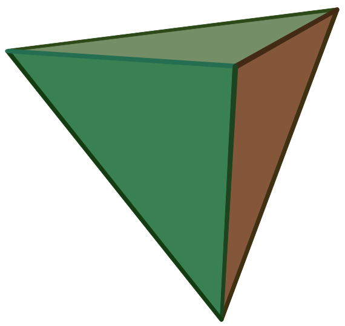
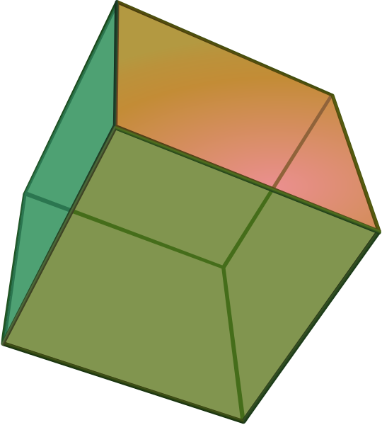
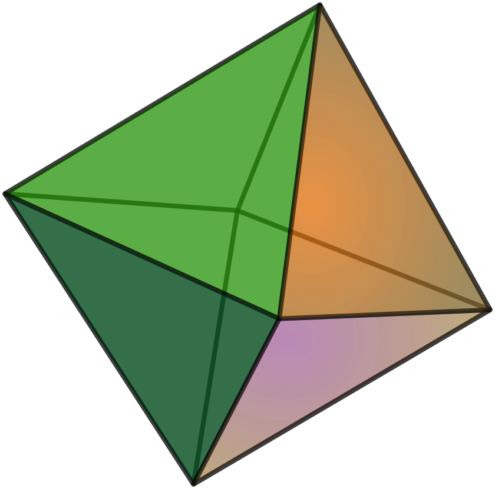
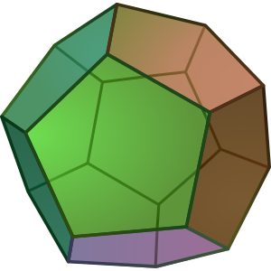
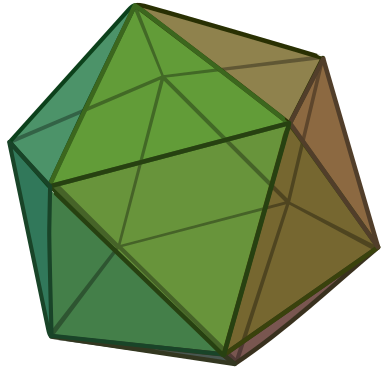

## Triceratops, unicorns $\text{[unicorn:1.0em]{.twemoji}}$ and polygons  {#sec-naming-things}

Some things are called after some inherent number or quantity.

| | Name | Meaning |
|:-----:|:-----|:------------|
| {width=250px} | **Tri**ceratops | 3-horned  |
| {width=250px} | **Uni**corn (**Mono**ceros) | 1-horned  |
| {width=250px} | **Octo**pus | 8-leged  |


Another prominent example of things named after a number are geometric figures.


### Geometric figures {.unnumbered .unlisted}


::: {.fun-fact image="/static_images/earth.pdf" width="0.7" scale="0.9"}
Geometry is an important branch of mathematics. We will come back to it later. The word "geometry" comes from the Greek word "γεωμετρία" (geometría) meaning "earth (or land) measurement."

According to an unverified story, there was an inscription at the entrance of Plato's Academy that read: "ἀγεωμέτρητος μηδεὶς εἰσίτω",  "Let none but geometers enter here."

You can think of these notes as your entry ticket.
:::


Polygons are 2-dimensional shapes. Regular polygonons are called after the number of their sides (or angles).

::: {.content-visible when-format="html"}

| Number | Greek number | Polygon name | Polygon |
|:---:|:---|:---|:---:|
| $\color{red}{3}$ | τρία | $\color{red}{\textbf{tri}}$angle | {width=50px} |
| $\color{red}{4}$ | τέσσερα | square ($\color{red}{\textbf{tetra}}$gon) | {width=50px} |
| $\color{red}{5}$ | πέντε | $\color{red}{\textbf{penta}}$gon | {width=50px} |
| $\color{red}{6}$ | έξι | $\color{red}{\textbf{hexa}}$gon | {width=50px} |
| $\color{red}{7}$ | επτά | $\color{red}{\textbf{hepta}}$gon | {width=50px} |
| $\color{red}{8}$ | οκτώ | $\color{red}{\textbf{octa}}$gon | {width=50px} |
| $\color{red}{9}$ | εννέα | $\color{red}{\textbf{ennea}}$gon | {width=50px} |
| $\color{red}{10}$ | δέκα | $\color{red}{\textbf{deca}}$gon | {width=50px} |

:::

::: {.content-visible when-format="pdf"}

\begin{table}[H]
\centering
\begin{tabular}{cccc}
Number & Greek number & Polygon name & Polygon \\
$\color{red}{3}$ & τρία & $\color{red}{\textbf{tri}}$angle & \drawpolygon{3} \\
$\color{red}{4}$ & τέσσερα & square ($\color{red}{\textbf{tetra}}$gon) & \drawpolygon{4} \\
$\color{red}{5}$ & πέντε & $\color{red}{\textbf{penta}}$gon & \drawpolygon{5} \\
$\color{red}{6}$ & έξι & $\color{red}{\textbf{hexa}}$gon & \drawpolygon{6} \\
$\color{red}{7}$ & επτά & $\color{red}{\textbf{hepta}}$gon & \drawpolygon{7} \\
$\color{red}{8}$ & οκτώ & $\color{red}{\textbf{octa}}$gon & \drawpolygon{8} \\
$\color{red}{9}$ & εννέα & $\color{red}{\textbf{ennea}}$gon & \drawpolygon{9} \\
$\color{red}{10}$ & δέκα & $\color{red}{\textbf{deca}}$gon & \drawpolygon{10} \\
\end{tabular}
\end{table}

:::


If we escape the 2-dimensional world of polygons and move to three dimensions in which we live, we can find polyhedra (meaning "many faces"). A die $\text{[game_die:1.5em]{.twemoji}}$ or a Rubik's cube are examples of a polyhedron with 6 faces.  The different polyhedra are also named after the number of their faces. The most famous ones are the Platonic solids. There are only five of them, and they are named after the number of their faces.

| Number | Greek Number | Name | |
|:---:|:---|:---|:---|
| $\color{red}{4}$ | τέσσερα | $\color{red}{\textbf{tetra}}$hedron | {width=20mm} |
| $\color{red}{6}$ | έξι | $\color{red}{\textbf{hexa}}$hedron | {width=20mm} |
| $\color{red}{8}$ | οκτώ | $\color{red}{\textbf{octa}}$hedron | {width=20mm} |
| $\color{red}{12}$ | δώδεκα | $\color{red}{\textbf{dodeca}}$hedron | {width=20mm} |
| $\color{red}{20}$ | είκοσι | $\color{red}{\textbf{icosa}}$hedron | {width=20mm} |

: The Platonic solids. Source images: Wikipedia


::: {.fun-fact title="Beautiful natural numbers"}
Now that you know what pentagons and triangles are, you can appreciate the beauty of triangular and pentagonal numbers. In general, figural numbers (there are also square, hexagonal, etc.) are beautiful natural numbers that can be arranged in different geometric patterns. For example, the following are the fifth triangular number and the fifth pentagonal number.

{width="70%" fig-align="center"}
:::


To identify a triangular or pentagonal numbers, you just have to count the number of dots in them.


```{python}
# | echo: false
# | label: fig-figural-2
# | out-width: 100%
# | fig-cap: "Count the number of points"

from yoyo_plots.common import display_vector
from yoyo_plots.figural import plot_figural

fig1 = plot_figural("triangular", 4, font_color="white")
display_vector(fig1)
```

```{python}
# | echo: false
# | label: fig-figural-3
# | out-width: 100%
# | fig-cap: "Count the number of points"

from yoyo_plots.figural import plot_figural
from yoyo_plots.common import display_vector

fig1 = plot_figural("triangular", 3, font_color="white")
display_vector(fig1)
```

```{python}
# | echo: false
# | label: fig-figural-4
# | out-width: 100%
# | fig-cap: "Count the number of points"

from yoyo_plots.figural import plot_figural
from yoyo_plots.common import display_vector

fig1 = plot_figural("pentagonal", 2, font_color="white")
display_vector(fig1)
```


::: {.teacher-tip}
This is the Python library for generating and drawing triangular and pentagonal numbers: [https://github.com/twaclaw/figural](https://github.com/twaclaw/figural).
:::