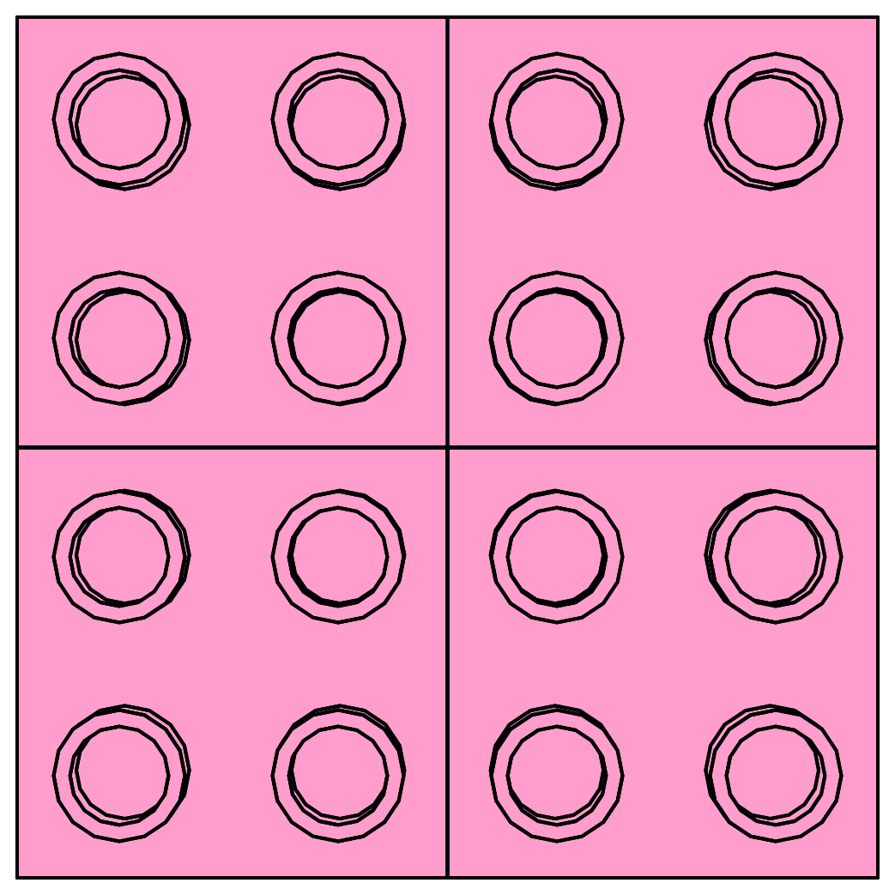
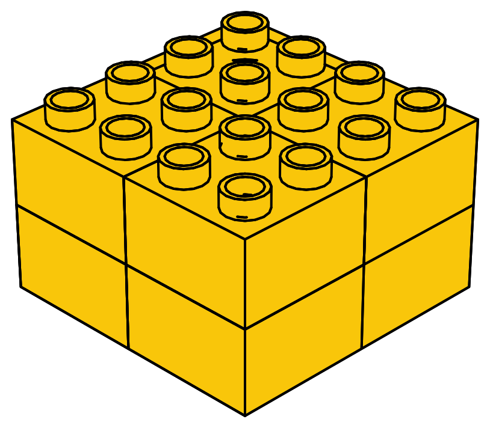
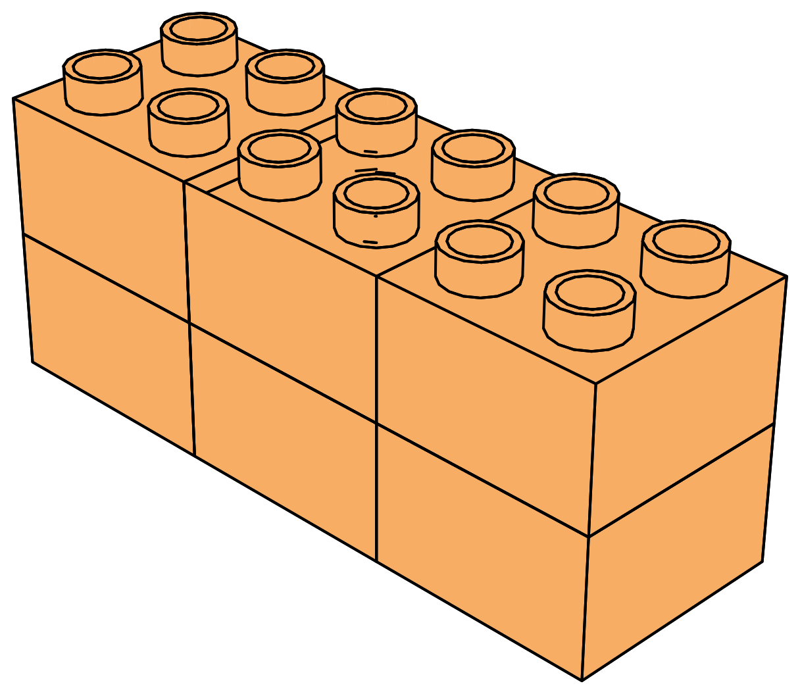

## Spotting patterns

As we saw earlier, multiplication is repeated addition—the special case that results from adding a value to itself multiple times. For example:


:::{.content-visible when-format="html"}
:::{.big-math}
$$
\begin{aligned}
\underbrace{3+3+3+3+3}_{{\color{red}{5}} \text{ times}} &= {\color{red}{5}} \times 3 = 15\\
\end{aligned}
$$
:::
:::

:::{.content-visible when-format="pdf"}
:::{.big-math}
:::{{latex}}
\begin{align*}
\underbrace{3+3+3+3+3}_{\eqnmarkbox[Red]{under}{{\color{red}{5}} \text{ times}}} &= \eqnmark[Red]{plus}{{\color{red}{5}}} \times 3 \\
\annotate[yshift=-0.2em]{below}{under, plus}{}
\end{align*}
:::
:::
:::


Adding $3$ to itself five times is the same as counting by threes five times.

```{python}
#| echo: false 
#| fig-align: "center"

from yoyo_plots.number_line import NumberLine
from yoyo_plots.common import display_vector

image = "/static_images/emojis/1f998_kangaroo_flipped.svg"
freq = 3
arc = {"color": "fuchsia", "len": freq, "text": f"+{freq}"}
fig = (NumberLine(0, 15, tick_frequency=3)
 .add_tick_icons({0: image})
 .add_arcs({i: arc for i in range(0, 15, freq)})
)
display_vector(fig)
```

That's the connection between multiplication and Kangaroo Math!


To count faster, we must learn to do two related yet independent things.

1. Spot a pattern in the objects we want to count.
2. Practice and memorize—or rather, internalize—the results of common multiplications.  

In the next section, we will start learning how to master multiplication results. For now, focus on spotting patterns in the objects you want to count.


### Exercises {.unnumbered .unlisted}

Try to identify the pattern in the following quantities, then write it down as a multiplication. 


{fig-align="center" width="60%"}

Here we have $5$ rows of $3$ bricks each. The total number of bricks is then [$5 \times 3$]{.scale factor="2"}.


{fig-align="center" width="30%"}

Here the total number of pink bricks is [$\boxed{\phantom{5}} \times \boxed{\phantom{3}}$]{.scale factor="2"}. 

{fig-align="center" width="80%"}

Here the total number of green bricks is [$\boxed{\phantom{5}} \times \boxed{\phantom{3}}$]{.scale factor="2"}. 

```{python}
# | echo: false
# | fig-align: center

from yoyo_plots.common import display_vector
from yoyo_plots.quantities import plot_quantity
image = "/static_images/emojis/1f989_owl.svg"
fig = plot_quantity(image, 24, nrows=4, font_color="black", image_size=0.8, quantity="6 x 4", pixels_per_unit=50)
display_vector(fig)
```


```{python}
# | echo: false
# | fig-align: center

from yoyo_plots.common import display_vector
from yoyo_plots.quantities import plot_quantity
image = "/static_images/emojis/1f9a7_orangutan.svg"
fig = plot_quantity(image, 16, nrows=4, font_color="white", image_size=0.8, quantity="4 x 4", pixels_per_unit=50)
display_vector(fig)
```


<!-- ```{python}
# | echo: false
# | fig-align: center

from yoyo_plots.common import display_vector
from yoyo_plots.quantities import plot_quantity
image = "/static_images/emojis/1f99b_hippo.svg"
fig = plot_quantity(image, 18, nrows=2, font_color="white", image_size=0.8, pixels_per_unit=50)
display_vector(fig)
``` -->

```{python}
# | echo: false
# | fig-align: center

from yoyo_plots.common import display_vector
from yoyo_plots.quantities import plot_quantity
image = "/static_images/emojis/1f427_penguin.svg"
fig = plot_quantity(image, 27, nrows=5, font_color="black", image_size=0.8, quantity="6 x 4 + 3", pixels_per_unit=50)
display_vector(fig)
```

There are $6$ rows of $4$ penguins each, plus an extra row with $3$ penguins. Note that the last row cannot be included in the multiplication because it has a different number of penguins than the other rows.


{fig-align="center" width="60%"}

There are $2$ layers of $2$ rows of $2$ bricks each. The total number of bricks is then [$2 \times 2 \times 2$]{.scale factor="2"}.


{fig-align="center" width="50%"}

The total number of orange bricks is [$\boxed{\phantom{5}} \times \boxed{\phantom{3}} \times \boxed{\phantom{2}}$]{.scale factor="2"}.


{fig-align="center" width="50%"}

The total number of yellow bricks is [$\boxed{\phantom{5}} \times \boxed{\phantom{3}} \times \boxed{\phantom{2}}$]{.scale factor="2"}.


