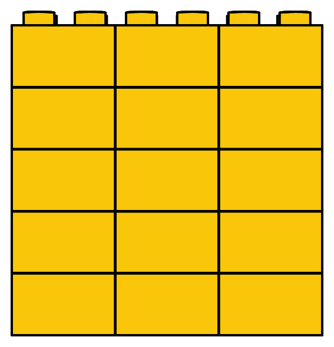

## Division

Imagine that you are playing a card game with your friends. It could be Uno, The Mind, or any other card game in which each player starts with an equal number of cards.

Let's say the game has $12$ cards and $3$ are three players. You start by splitting the cards. Initially, each player has $0$ cards.


```{python}
# | echo: false
# | fig-align: center

from yoyo_plots.division import CardGame, CardHolder
from yoyo_plots.common import display_vector
from PIL.ImageShow import show

players = ["1f646-1f3ff_person1.svg", "1f937-1f3fd_person2.svg", "1f469-1f3fb-200d-1f692_person.svg"]

characters = [CardHolder(character_image=f"/static_images/emojis/{player}", fold_cards=True, draw_number=True, number=0) for player in players]

game = CardGame(
    total=12,
    fold_total=False,
    holders=characters
)
display_vector(game)
```

Start by giving each player one card at a time. After the first round, each player will have $1$ card.

```{python}
# | echo: false
# | fig-align: center


from yoyo_plots.division import CardGame, CardHolder
from yoyo_plots.common import display_vector


characters = [CardHolder(character_image=f"/static_images/emojis/{player}", fold_cards=True, draw_number=True, number=1) for player in players]

game = CardGame(
    total=9,
    fold_total=False,
    holders=characters
)
display_vector(game)
```

After the second round, each player will have $2$ cards.

```{python}
# | echo: false
# | fig-align: center


from yoyo_plots.division import CardGame, CardHolder
from yoyo_plots.common import display_vector


characters = [CardHolder(character_image=f"/static_images/emojis/{player}", fold_cards=True, draw_number=True, number=2) for player in players]

game = CardGame(
    total=6,
    fold_total=False,
    holders=characters
)
display_vector(game)
```

After the third round, each player will have $3$ cards.

```{python}
# | echo: false
# | fig-align: center


from yoyo_plots.division import CardGame, CardHolder
from yoyo_plots.common import display_vector


characters = [CardHolder(character_image=f"/static_images/emojis/{player}", fold_cards=True, draw_number=True, number=3) for player in players]
game = CardGame(
    total=3,
    fold_total=False,
    holders=characters
)
display_vector(game)
```

This continues until all cards are distributed. 

```{python}
# | echo: false
# | fig-align: center

from yoyo_plots.division import CardGame, CardHolder
from yoyo_plots.common import display_vector


characters = [CardHolder(character_image=f"/static_images/emojis/{player}", fold_cards=True, draw_number=True, number=4) for player in players]

game = CardGame(
    total=0,
    fold_total=False,
    holders=characters
)
display_vector(game)
```


By the end, every player has $4$ cards.

This process of splitting into equal parts is called _division_. In the previous example, we said that $12$ cards divided among $3$ players equals $4$ cards per player. There are different ways to write this.


:::{.big-math}
$$
12 \div 3 =  12/3 = \frac{12}{3} = 4
$$
:::

:::{.question}
How many cards will each player get if you invite a new friend and play the same game with $4$ players?

:::

```{python}
# | echo: false
# | fig-align: center

from yoyo_plots.division import CardGame, CardHolder
from yoyo_plots.common import display_vector

players = ["1f646-1f3ff_person1.svg", "1f937-1f3fd_person2.svg", "1f469-1f3fb-200d-1f692_person.svg", "1f9b8-1f3fd-200d-2640-fe0f_person.svg"]

characters = [CardHolder(character_image=f"/static_images/emojis/{player}", fold_cards=True, draw_number=True, number=0, font_color="white") for player in players]

game = CardGame(
    total=12,
    fold_total=False,
    holders=characters
)
display_vector(game)
```

If we follow the same process of giving out the cards one by one, we end up with each player holding $3$ cards.


```{python}
# | echo: false
# | fig-align: center

from yoyo_plots.division import CardGame, CardHolder
from yoyo_plots.common import display_vector

players = ["1f646-1f3ff_person1.svg", "1f937-1f3fd_person2.svg", "1f469-1f3fb-200d-1f692_person.svg", "1f9b8-1f3fd-200d-2640-fe0f_person.svg"]

characters = [CardHolder(character_image=f"/static_images/emojis/{player}", fold_cards=True, draw_number=True, number=3) for player in players]

game = CardGame(
    total=0,
    fold_total=False,
    holders=characters
)
display_vector(game)
```

This can be written as follows:

:::{.big-math}
$$
12 \div 4 =  12/4 = \frac{12}{4} = 3
$$
:::

### What is division? {.unnumbered .unlisted}

Just as subtraction is the inverse of addition, division is the inverse of multiplication. 

To see this, let's review the previous results and try to connect them with multiplication. We can write the first result as follows:


:::{.content-visible when-format="html"}
:::{.big-math}
$$
\begin{align*}
\frac{12}{3} &= 4 \\
12 &= 3 \times 4
\end{align*}
$$
:::
:::

:::{.content-visible when-format="pdf"}
:::{.big-math}
:::{{latex}}
\begin{equation*}
\frac{\eqnmarkbox[Red]{a1}{12}}{\eqnmarkbox[Blue]{b1}{3}} = \eqnmarkbox[OliveGreen]{c1}{4}
\end{equation*}

\begin{equation*}
\eqnmarkbox[Red]{a2}{12} = \eqnmarkbox[Blue]{b2}{3} \times \eqnmarkbox[OliveGreen]{c2}{4}
\end{equation*}
:::
:::
:::

For example, we determined that there are $5\times 3 = 15$ LEGO bricks in the following image:

{fig-align="center" width="60%"}

We can also work backwards and ask, given that there are $15$ LEGO bricks, how many rows of $3$ bricks can we build? $15/3 = 5$. How many columns of $5$ bricks can we build? $15/5 = 3$.


In general, if an integer $c$ is the product of two integers $a$ and $b$,


:::{.big-math}
$$
c = a \times b
$$
:::

We known than $c$ can be divided by both $a$ and $b$: 


:::{.big-math}
\begin{align*}
c \div b &= a \\
c \div a &= b
\end{align*}
:::

This means that we can use multiplication tables to find division results.

For example, if I asked you to solve the following division problem:


:::{.big-math}
$$
\frac{35}{5} = \boxed{?}
$$
:::

We can look at the multiplication table to find the values where the product is $35$.
Then, we can check if any of the columns or rows of those values contains a $5$.

```{python}
# | echo: false
# | fig-align: center
from yoyo_plots.multiplication import draw_operation_table
from yoyo_plots.common import display_vector

n = 11
result = 35
divider = 5
fig = draw_operation_table(
    nrows=n, ncols=n,
    show_upper=True,
    elements={(5, 7): "coral"},
    rows = {5: "lightblue"},
    cols = {7: "lightblue"},
)
display_vector(fig)
```


Since $35$ is the product of $5$ and $7$, we can conclude that $35 \div 5 = 7$.


### Exercises {.unnumbered .unlisted}

- If I have $20$ LEGO bricks, how many towers of $4$ bricks each can I build?
- If my grandparents bring me and my sister $8$ bombons, and we want to split them equally, how many will each of us get?
- Compute the following divisions using the multiplication table:

:::{.big-math}
\begin{align*}
    36 \div 6 &= \boxed{\phantom{6}} \\
    48 \div 8 &= \boxed{\phantom{6}} \\
    56 \div 7 &= \boxed{\phantom{8}} \\
    63 \div 9 &= \boxed{\phantom{7}} \\
    72 \div 8 &= \boxed{\phantom{9}} \\
    100 \div 10 &= \boxed{\phantom{10}} \\
\end{align*}
:::

- In the following games, how many cards does each player get?

```{python}
# | echo: false
# | fig-align: center

from yoyo_plots.division import CardGame, CardHolder
from yoyo_plots.common import display_vector
import random

players = ["1f992_giraffe.svg", "1f994_hedgehog.svg", "1f99b_hippo.svg", "1f9a7_orangutan.svg", "1f998_kangaroo.svg"]

numbers = [21, 20, 15, 9]
dividers = [3, 4, 5, 3]

for n, d in zip(numbers, dividers):
    random.shuffle(players)
    characters = [CardHolder(character_image=f"/static_images/emojis/{players[i]}", fold_cards=True, draw_number=True, number=0, font_color="white") for i in range(d)]

    game = CardGame(
        total=n,
        fold_total=False,
        holders=characters
)
    print(f"{n} cards divided by {d} players:")
    display_vector(game)
```


<!-- In the same way as subtraction is the inverse operation of addition, splitting or dividing is the inverse operation of multiplication.  Division is the process of splitting a quantity into equal parts or groups.

- Division: use the same multiplication table
    - Dividing cards
    - Lego towers
    - Splitting a circle

- In mathematics there is almost always an inverse operation: 
    - Addition and subtraction
    - Multiplication and division
    - Exponentiation and logarithm and roots -->

