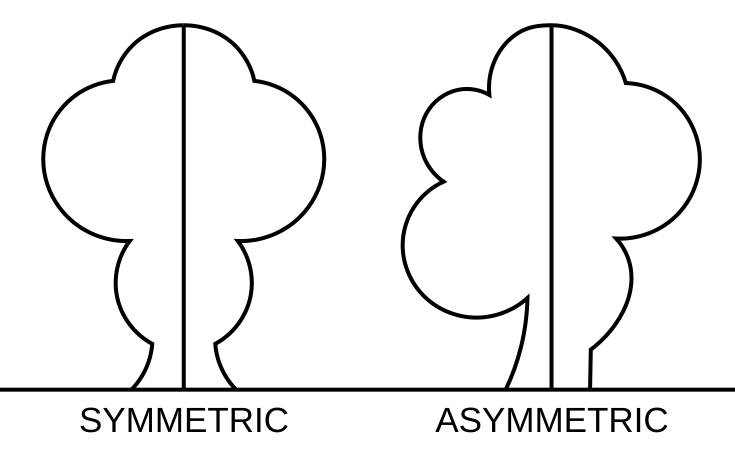

## Symmetries of a Square


Let's do some bricolage! Print this page and the next one, then cut out the colored squares. Then, glue them together so that the colors match. It's helpful to print two sets so you can make comparisons. Leave the white square on the page.


```{python}
# | echo: false
# | fig-align: center

from yoyo_plots.permutations import (
    SquareSymmetries, Permutation, Rotation, FlipAxis,
    compose, draw_composition,
)
from yoyo_plots.common import display_vector, combine_svgs

SIZE = 200
plain   = SquareSymmetries(color=False,show_numbers=False, size=SIZE).draw_flip_symmetries()
front = SquareSymmetries(size=SIZE).draw_flip_symmetries()
flipped = SquareSymmetries(size=SIZE).flip_around_axis(FlipAxis.C).draw_flip_symmetries()
display_vector(front)
display_vector(flipped)
display_vector(plain)
```

We will now consider shape-preserving or symmetric transformations of this colorful paper square. In other words, this means any rotation or flipping of the square that allows you to superimpose it on the white square on the page without it falling off.


:::{.teacher-tip}
Explain why rotating the square by $45$ degrees results in a square that doesn't fit the original or coincide with the fixed white square left on the page. 
:::


:::{.fun-fact title="Symmetry" image="/static_images/monarch_butterfly2.pdf" width="0.7" scale="0.9"}
Symmetry, from the ancient Greek word συμμετρία, is one of the most profound and pervasive concepts in nature and mathematics. It governs our perception of beauty, dictates how energy is conserved, and underpins our understanding of music, physics, chemistry, and the world itself.  Symmetry is beautiful and important. In a sense, group theory is the mathematical study of symmetry.

Below are examples of symmetric and asymmetric figures. Source: [Wikimedia](https://commons.wikimedia.org/wiki/File:Asymmetric_(PSF).svg#/media/File:Asymmetric_(PSF).svg).

Print this page and cut out the images. Then, fold each image along the vertical, straight line. What is the difference between symmetric and asymmetric figures?




:::

### Rotations {.unnumbered .unlisted}

One such transformation, for example, is obtained by rotating the square by a quarter  ($\frac{1}{4}$) turn ($90$ degrees). 


:::{.teacher-tip}

Here, I am using a passive convention, which means that when we rotate $90$ degrees, for example, the set of numbers $\{1, 2, 3, 4\}$ is sent to the set of numbers $\{4, 1, 2, 3\}$. In other words, $1$ is mapped to the number that replaces it after the square is rotated while keeping the frame of reference constant. I adopted this convention to make the colors work. It differs from the active convention used in textbooks such as Charles Pinter's wonderful book on abstract algebra, in which rotating by $90$ degrees clockwise sends the set of numbers $\{1, 2, 3, 4\}$ to the set of numbers $\{2, 3, 4, 1\}$. In this case, the corner numbers remain fixed, and $1$ occupies the position previously occupied by $2$.

The two approaches should be equivalent, even if some of the rotations are reverted.
:::

```{python}
# | echo: false
# | fig-align: center
from yoyo_plots.permutations import (
    SquareSymmetries, Permutation, Rotation, FlipAxis,
    compose, draw_composition,
)
from yoyo_plots.common import display_vector, combine_svgs


for rot in [Rotation.R90]:
    arc   = SquareSymmetries().draw_rotation(rot).to_svg()
    turned = SquareSymmetries().rotate(rot).to_svg()
    display_vector(combine_svgs([arc, turned], separators=["→"], spacing=30))
```

These symmetry-preserving transformations can be thought of as functions that map the set of corners of the square, $S = \{1, 2, 3, 4\}$, to itself. It is a permutation, $R:S\to S$.


Rotating the square by one-quarter turn can be seen as a function, $R_1:S\to S$, that sends the original order, ${1,2,3,4}$, to ${4,1,2,3}$.


```{python}
# | echo: false
# | fig-align: center

from yoyo_plots.permutations import R1
from yoyo_plots.common import display_vector, combine_svgs

perm = R1()

display_vector(perm)
```

After applying the rotation $R_1$, $4$ is in the position that $1$ was in before, $1$ is in the position that $2$ was in before, and so on.

Symmetry is also preserved if we rotate the square by either half ($180$ degrees) or three-quarters ($270$ degrees). For example, rotating the square $180$ degrees  can be seen as a function, $R_2: S \to S$, that maps the original order, $\{1, 2, 3, 4\}$, to $\{3, 4, 1, 2\}$. 


```{python}
# | echo: false
# | fig-align: center
from yoyo_plots.permutations import (
    SquareSymmetries, Permutation, Rotation, FlipAxis,
    compose, draw_composition,
)
from yoyo_plots.common import display_vector, combine_svgs


for rot in [Rotation.R180]:
    arc   = SquareSymmetries().draw_rotation(rot).to_svg()
    turned = SquareSymmetries().rotate(rot).to_svg()
    display_vector(combine_svgs([arc, turned], separators=["→"], spacing=30))
```


```{python}
# | echo: false
# | fig-align: center

from yoyo_plots.permutations import R2
from yoyo_plots.common import display_vector, combine_svgs

perm = R2()

display_vector(perm)
```


### Flips {.unnumbered .unlisted}

In addition to rotating the square, we can also flip it around the vertical, horizontal, or diagonal axes. This flipping preserves symmetry, meaning you can still superimpose it on the white square above. Try it yourself!

```{python}
# | echo: false
# | fig-align: center

from yoyo_plots.permutations import (
    SquareSymmetries, Permutation, Rotation, FlipAxis,
    compose, draw_composition,
)
from yoyo_plots.common import display_vector, combine_svgs

axes    = SquareSymmetries(color=True).draw_flip_symmetries()
display_vector(axes)
```

Again, flipping the square along one of its axes can be thought of as a function, $R: S \to S$, or a permutation. 

For example, flipping the square along the axis $C$ results in:


```{python}
# | echo: false
# | fig-align: center

from yoyo_plots.permutations import R4
from yoyo_plots.common import display_vector, combine_svgs

flipped = R4()
display_vector(flipped)
```

This corresponds to the following mapping:

```{python}
# | echo: false
# | fig-align: center

from yoyo_plots.permutations import R4
from yoyo_plots.common import display_vector, combine_svgs

display_vector(R4())
```


Another example of a flip is the one around the $D$ axis.


```{python}
# | echo: false
# | fig-align: center

from yoyo_plots.permutations import (
    SquareSymmetries, Permutation, Rotation, FlipAxis,
    compose, draw_composition,
)
from yoyo_plots.common import display_vector, combine_svgs

flipped = SquareSymmetries(color=True).flip_around_axis(FlipAxis.D)
display_vector(flipped)
```

This corresponds to the following mapping:


```{python}
# | echo: false
# | fig-align: center

from yoyo_plots.permutations import R7
from yoyo_plots.common import display_vector, combine_svgs

display_vector(R7())
```

Here is a summary of the symmetries of our colorful square.

| $f: S\to S$ | Description |
| :--- | :--- |
| $R_0$ | Identity: do nothing. |
| $R_1$ | Rotate by $1/4$ of a turn, $90$ degrees. |
| $R_2$ | Rotate by $1/2$ of a turn, $180$ degrees. |
| $R_3$ | Rotate by $1/4$ of a turn, $270$ degrees. |
| $R_4$ | Flip about axis $A$ |
| $R_5$ | Flip about axis $B$ |
| $R_6$ | Flip about axis $C$ |
| $R_7$ | Flip about axis $D$ |

Since these transformations are invertible functions, they can be composed. Composition simply means performing one operation after another.

For example, take the paper square and apply the transformation.


:::{.big-math}
:::{.content-visible when-format="pdf"}
\begin{equation*}
[R_4 \circ R_1](x) = \eqnmarkbox[Blue]{r4}{R_4}(\eqnmarkbox[Red]{r1}{R_1(x)})
\annotate[yshift=0.2em]{above, right}{r1}{First, rotate by 90 degrees}
\annotate[yshift=0.2em]{above, left}{r4}{Then flip about axis A}
\end{equation*}
:::

:::{.content-visible when-format="html"}
$$
[R_4 \circ R_1](x) = R_4(R_1(x))
$$
:::
:::

First, we apply $R_1$, which rotates the square by $1/4$. Then, we apply $R_4$, which flips about the axis $A$, to the result.

```{python}
# | echo: false
# | fig-align: center

from yoyo_plots.permutations import R4, R1, draw_composition
from yoyo_plots.common import display_vector, combine_svgs
display_vector(draw_composition([R4(), R1()], result_name="R_7"))
```

:::{.question}
What does it mean that $R_4 \circ R_1 = R_7$?
:::
It means that applying $R_4\circ R_1$, i.e., first rotating by $90$ degrees and then flipping about axis $A$, is equivalent to applying $R_7$, which flips the square about axis $D$.

Try to convince yourself.


```{python}
# | echo: false
# | fig-align: center

from yoyo_plots.permutations import (
    SquareSymmetries, Permutation, Rotation, FlipAxis,
    compose, draw_composition,
)
from yoyo_plots.common import display_vector, combine_svgs

flipped = SquareSymmetries().flip_around_axis("D")

R7 = flipped.to_permutation(name="R_7")
display_vector(combine_svgs([flipped.to_svg(), R7, ]))
```


### Group of symmetries {.unnumbered .unlisted}

The symmetries of the square, $S_G = \{R_0, R_1, \cdots R_7\}$, forms a group under the operation of function composition, $\circ$. Remember our checklist? Let's take a look at the Cayley table of the group.

```{python}
# | echo: false
# | fig-align: center

from yoyo_plots.multiplication import draw_operation_table
from yoyo_plots.permutations import SquareSymmetries, Permutation, compose, R1, R2, R3, R4, R5, R6, R7
from yoyo_plots.common import display_vector

moves = [
    SquareSymmetries().to_permutation().bottom,                       # R0  identity
    R1().bottom,
    R2().bottom,
    R3().bottom,
    R4().bottom,
    R5().bottom,
    R6().bottom,
    R7().bottom, # R7  flip D
]
index = {p: i for i, p in enumerate(moves)}

def prod(i, j):
    return index[compose(Permutation((1, 2, 3, 4), moves[i]),
                         Permutation((1, 2, 3, 4), moves[j])).bottom]

fig = draw_operation_table(
    nrows=8, ncols=8,
    operation=lambda i, j: f"R<sub>{prod(i, j)}</sub>",
    operation_name="∘",
    show_upper=False,
    header_label=lambda k: f"R<sub>{k}</sub>",  # row/column headers R₀..R₇
    operation_font_size=40,  
)
display_vector(fig)
```


- $\text{[check_mark_button:1.5em:-0.3em]{.twemoji}}$ **Closure and associativity**: The composition of two elements of $S_G$  is also in $S_G$. For example, as we saw above and can verify in the table, $R_4 \circ R_1 = R_7 \in S_G$.

- $\text{[check_mark_button:1.5em:-0.3em]{.twemoji}}$ **Existence of an identity element**: There is a _neutral_ function, $R_0$, that sends a permutation to itself. This is illustrated by the highlighted row and column in the following figure.

```{python}
# | echo: false
# | fig-align: center

from yoyo_plots.multiplication import draw_operation_table
from yoyo_plots.permutations import SquareSymmetries, Permutation, compose
from yoyo_plots.common import display_vector

index = {p: i for i, p in enumerate(moves)}

def prod(i, j):
    return index[compose(Permutation((1, 2, 3, 4), moves[i]),
                         Permutation((1, 2, 3, 4), moves[j])).bottom]

fig = draw_operation_table(
    nrows=8, ncols=8,
    operation=lambda i, j: f"R<sub>{prod(i, j)}</sub>",
    operation_name="∘",
    show_upper=False,
    rows={0: "lightblue"},
    cols={0: "lightblue"},
    header_label=lambda k: f"R<sub>{k}</sub>",  # row/column headers R₀..R₇
    operation_font_size=40,  
)
display_vector(fig)
```

- $\text{[check_mark_button:1.5em:-0.3em]{.twemoji}}$ **Existence of an inverse**: Every element in $S_G$ can be mapped to the identity element, $R_0$, using composition with another element. 

For instance all the flipping operations $R_4 \cdots R_7$ are their own inverse. The inverse of $R_3$ is $R_1$ because $R_3 \circ R_1 = R_0$,  as illustrated in the following figure.


```{python}
# | echo: false
# | fig-align: center

from yoyo_plots.multiplication import draw_operation_table
from yoyo_plots.permutations import SquareSymmetries, Permutation, compose
from yoyo_plots.common import display_vector

index = {p: i for i, p in enumerate(moves)}

def prod(i, j):
    return index[compose(Permutation((1, 2, 3, 4), moves[i]),
                         Permutation((1, 2, 3, 4), moves[j])).bottom]

fig = draw_operation_table(
    nrows=8, ncols=8,
    operation=lambda i, j: f"R<sub>{prod(i, j)}</sub>",
    operation_name="∘",
    show_upper=False,
    rows={3: "lightblue"},
    cols={1: "lightblue"},
    elements = {(3, 1): "coral"},
    header_label=lambda k: f"R<sub>{k}</sub>",  # row/column headers R₀..R₇
    operation_font_size=40,   
)
display_vector(fig)
```


### Exercises {.unnumbered .unlisted}

:::{.question}
Why don't we list rotations that are multiples of one turn, such as $1$ or $2$ or $10$ turns?
:::

Complete the following mappings.

- $R_3$, rotage by $270$ degrees. 

```{python}
# | echo: false
# | fig-align: center

from yoyo_plots.permutations import (
    SquareSymmetries, Permutation, Rotation, FlipAxis,
    compose, draw_composition,
)
from yoyo_plots.common import display_vector, combine_svgs

rot=Rotation.R270
arc   = SquareSymmetries().draw_rotation(rot).to_svg()
turned = SquareSymmetries().rotate(rot)
display_vector(combine_svgs([arc, turned.to_svg()], separators=["→"], spacing=30))

R3 = turned.to_permutation(name="R_3", blank=True)
display_vector(R3)
```

- $R_5$: flip about axis $B$.


```{python}
# | echo: false
# | fig-align: center

from yoyo_plots.permutations import R5
from yoyo_plots.common import display_vector, combine_svgs


r = R5(blank=True)
display_vector(r)
```


Use your paper square to compute the following operations. Use the Cayley table above to verify.


```{python}
# | echo: false
# | fig-align: center

from yoyo_plots.permutations import (
    SquareSymmetries, Permutation, Rotation, FlipAxis, R4, R5,
    compose, draw_composition,
)
from yoyo_plots.common import display_vector, combine_svgs

display_vector(draw_composition([R4(), R5()], result_name="?", blank_result=True))
```


```{python}
# | echo: false
# | fig-align: center

from yoyo_plots.permutations import (
    SquareSymmetries, Permutation, Rotation, FlipAxis, R4, R5,
    compose, draw_composition,
)
from yoyo_plots.common import display_vector, combine_svgs

display_vector(draw_composition([R4(), R4()], result_name="?", blank_result=True))
```


```{python}
# | echo: false
# | fig-align: center

from yoyo_plots.permutations import (
    SquareSymmetries, Permutation, Rotation, FlipAxis, R1,
    compose, draw_composition,
)
from yoyo_plots.common import display_vector, combine_svgs

display_vector(draw_composition([R1(), R1()], result_name="?", blank_result=True))
```


```{python}
# | echo: false
# | fig-align: center

from yoyo_plots.permutations import (
    SquareSymmetries, Permutation, Rotation, FlipAxis, R1, R2,
    compose, draw_composition,
)
from yoyo_plots.common import display_vector, combine_svgs

display_vector(draw_composition([R1(), R2()], result_name="?", blank_result=True))
```


```{python}
# | echo: false
# | fig-align: center

from yoyo_plots.permutations import (
    SquareSymmetries, Permutation, Rotation, FlipAxis, R3, R5,
    compose, draw_composition,
)
from yoyo_plots.common import display_vector, combine_svgs

display_vector(draw_composition([R3(), R5()], result_name="?", blank_result=True))
```

