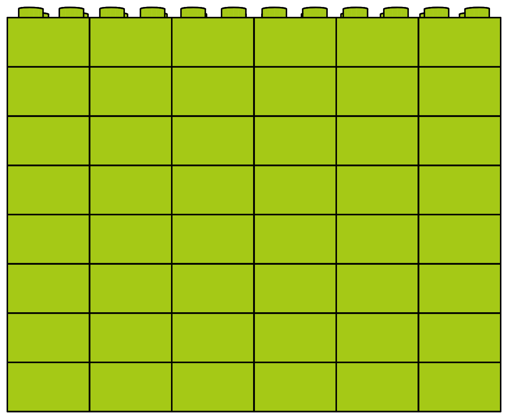
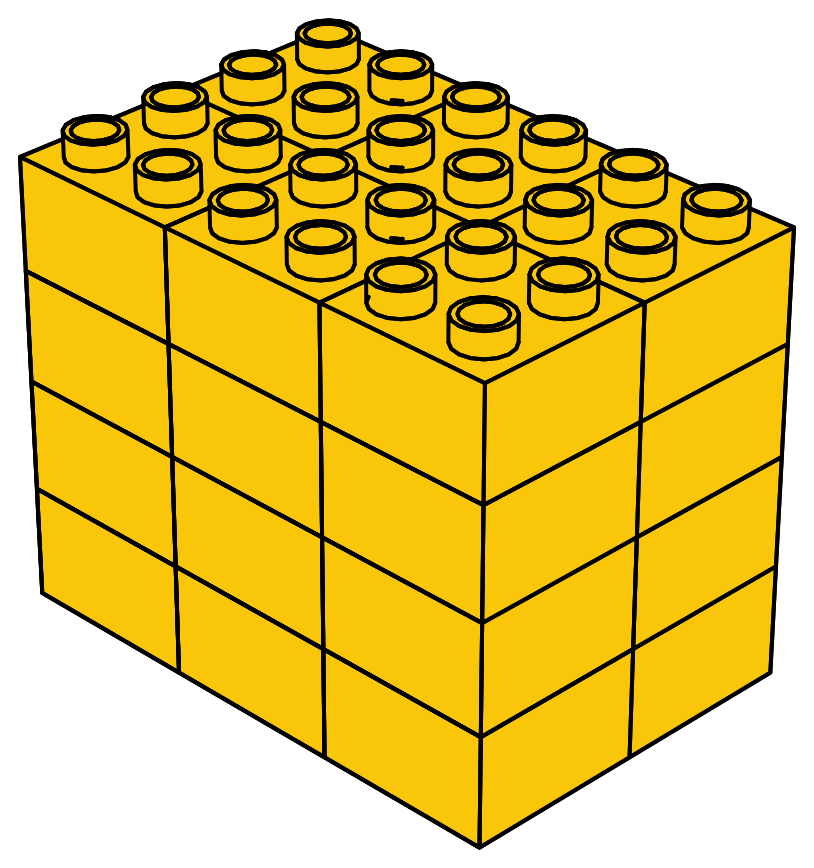

# Multiplication and geometry

We began our journey of learning multiplication by discerning patterns. Then, we learned how to express those patterns as the product of two or three integers. Finally, we learned how to compute those products using multiplication tables. 
Now, we are cycling back and formalizing the idea of patterns, making a link between multiplication and geometry. Specifically, we are exploring how multiplying two natural numbers produces a two-dimensional object called a plane and how multiplying three natural numbers produces a three-dimensional object called a volume.

Remember that in @sec-battle-ship, we defined a dimension as one of the directions in which you can move. Here, $N$ represents the number of dimensions.

| $N$ | Object | Symbol | How can we move?| How to construct?|
| - | -- | -- | ---------- | ----- |
| 0 | Point | $\color{red}{\bullet}$ | We cannot move.| |
| 1 | Line | $\color{red}{\rule{2cm}{0.8pt}}$ | We can move only forward and backward.| $d$ |
| 2 | Plane | ``{=html}`$\color{red}{\drawpolygon[red]{4}}$`{=latex} | We can move forward and backward, and also left and right.| $d \times d = d^2$|
| 3 | Volume | $\text{[game_die:4em]{.twemoji}}$ | We can move left, right, forward, backward, and jump up and down.| $d \times d \times d = d^3$|

An area is a measurement that indicates the size of a two-dimensional object. For instance, the area of the wall pictured below equals the number of LEGO bricks that comprise it.

{fig-align="center" width="80%"}

The area is equal to the total number of green bricks: [$6 \times 8 = 48$]{.scale factor="2"}. 

Count the bricks if you want to be convinced.

:::{.fun-fact title="What is an area?"}
The area of a wall that is $w$ LEGO bricks wide and $h$ LEGO bricks high is equal to the number of bricks in the wall. We can compute it as follows:

:::{.big-math}
$$
\text{area} = w \times h
$$
:::

Note that this is true for walls of any width, $w$, and height, $h$. 
:::

Similarly, volume is a measure of the size of a three-dimensional object. For example, the volume of the cube below is equal to the number of LEGO bricks that make up the cube.

{fig-align="center" width="50%"}

The volume is equal to the total number of yellow bricks: [$3 \times 4 \times 2 = 24$]{.scale factor="2"}.

:::{.fun-fact title="What is an volume?"}
The volume of a box with width $w$, height $h$, and depth $d$ is the number of LEGO bricks that can fit inside the box. We can compute it as follows:

:::{.big-math}
$$
\text{volume} = w \times h \times d
$$
:::

Keep in mind that this is true for any box with a width of $w$, a height of $h$, and a depth of $d$.
:::





